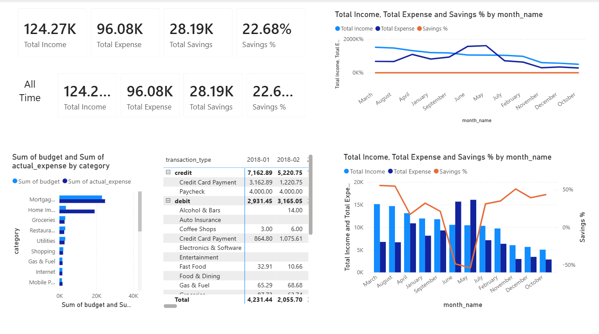
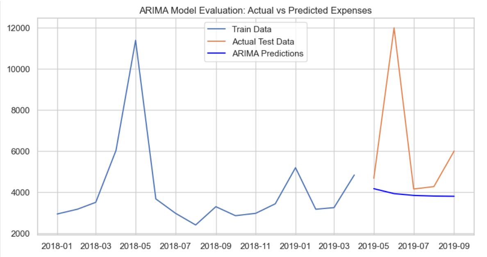
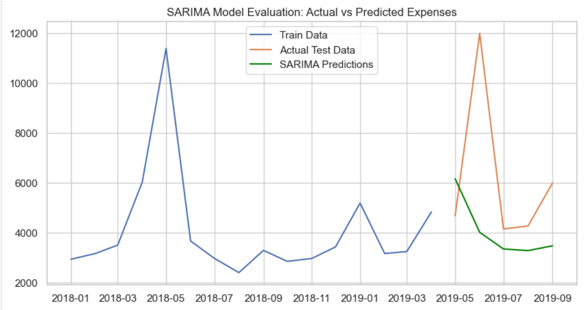
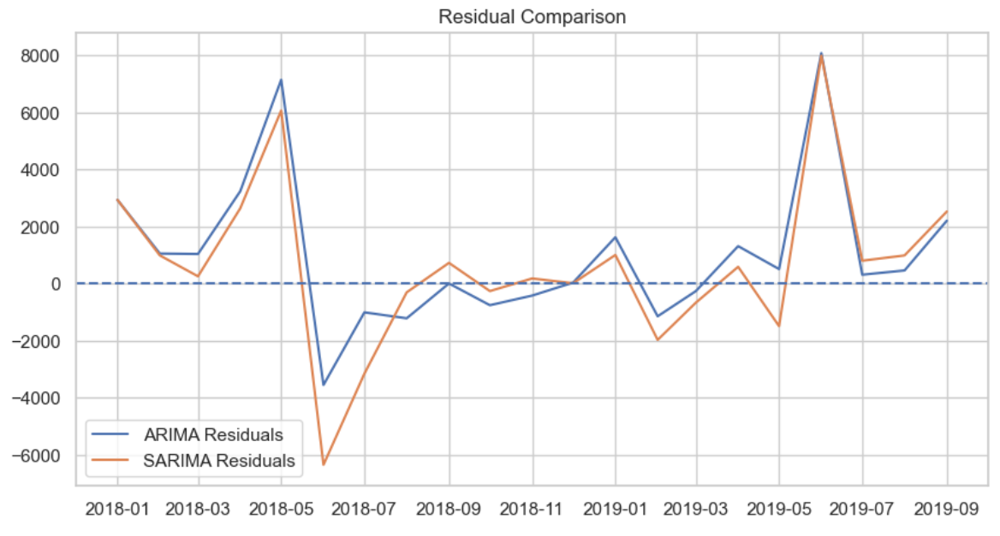
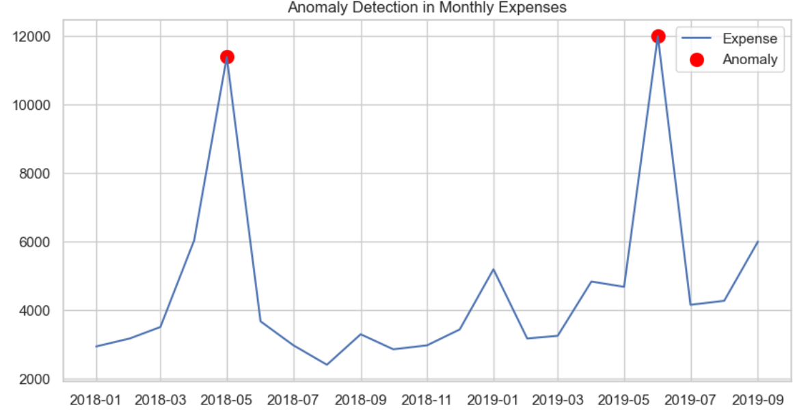

# Personal Finance Forecasting and Anomaly Detection using Time Series (SARIMA/ARIMA) | Data Science Project

## 📌 Project Overview
This project analyzes personal financial transaction data to uncover spending patterns, evaluate budget performance, and forecast future expenses using machine learning and time series models.

The goal is to demonstrate end-to-end data science skills including data cleaning, exploratory data analysis, visualization, dashboarding, and predictive modeling.

---

## 📊 Key Features

### 1. Data Processing & EDA
- Cleaned and transformed raw transaction data
- Monthly aggregation of income and expenses
- Category-wise spending analysis
- Trend and pattern identification

### 2. Dashboard & Visualization
- Interactive Power BI dashboard
- KPIs: Total Income, Expenses, Savings, Budget Variance
- Monthly trends and category breakdown
- Financial performance insights

### 3. Machine Learning & Forecasting
- ARIMA and SARIMA models for expense forecasting
- Model evaluation using RMSE, MAE, and MAPE
- Residual analysis for model validation
- 6-month future expense prediction
- Anomaly detection in spending behavior

---

## 🛠️ Technologies Used
- Python (Pandas, NumPy, Matplotlib, Scikit-learn, Statsmodels)
- Jupyter Notebook
- Power BI
- Git & GitHub

---

## 📈 Results & Insights
- Identified key spending categories and seasonal trends
- SARIMA model outperformed ARIMA in forecasting accuracy
- Detected unusual expense patterns using residual analysis
- Provided data-driven insights for financial planning

---
## 📊 Visualizations & Model Results

### 1️⃣ Power BI Dashboard

The dashboard provides a comprehensive overview of income, expenses, savings, and category-wise spending. It helps understand financial patterns and supports data-driven budgeting decisions.

### 2️⃣ Exploratory Data Analysis (Monthly Income vs Expense)

This visualization shows the trend of monthly income and expenses over time. It highlights periods of overspending and savings behavior.

### 3️⃣ ARIMA Model Forecasting

The ARIMA model was used to forecast monthly expenses based on historical data. The plot compares actual expenses with predicted values to evaluate model performance.

### 4️⃣ SARIMA Model Forecasting

SARIMA was implemented to capture seasonal patterns in monthly expenses. The model demonstrates improved forecasting accuracy by considering seasonality.

### 5️⃣ Residual Analysis (ARIMA vs SARIMA)

Residual plots were analyzed to evaluate model performance and error patterns. SARIMA showed more stable residuals, indicating better predictive capability.

### 6️⃣ Anomaly Detection in Expenses

Anomaly detection techniques were applied to identify unusual spending patterns. The model highlights months with abnormal expenses that may require further investigation.

## 👩‍💻 Author
Ayushi Patel  
Aspiring Data Scientist | Data Analyst | Software Engineer